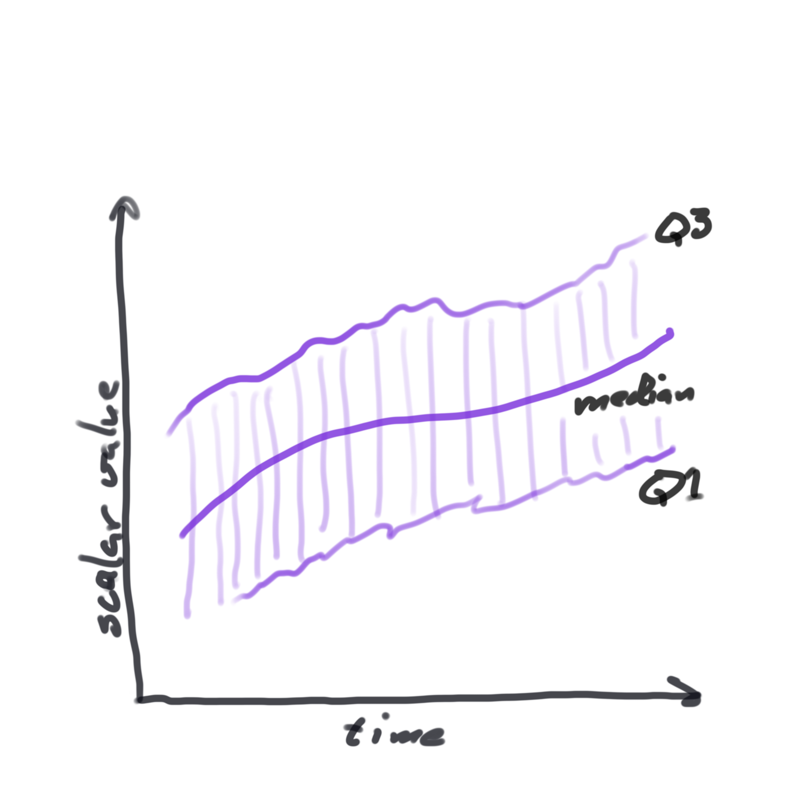

### Build A Non-Trivial Graph Using matplotlib

In this project, you will write code to display a statistical
time series dataset, with the median-and-IQR idiom (see below).  We
will use the California COVID dataset.


<span class='image60'>.</span>


### Step 1: Imports and data

```
%matplotlib qt
import math  # because you may need math.nan and math.isnan
import pandas as pd
import matplotlib.pyplot as plt
from datetime import date  # to manipulate date strings
```

Download **covid19cases_test.csv** from the Github data directory,
and import it using pd.read_csv().  Or, if you want more recent data,
see the README file for details on downloading an up-to-date version
of the dataset.


### Step 2: Create a date_offset column

This is best done by defining a function that computes a date offset integer
given a date or a spreadsheet row, and using the Pandas DataFrame
*applymap* or *apply* methods to compute the new column.


The dates in the data are given as strings, like "2020-02-01" .  We need
a numerical date.  This can be computed by converting the 'date' column
to a datetime.date object, subtracting the date object for "2020-02-01", and
returning the *date.days* field of that object.


There is a complication though, since some date entries are missing, and
thus they contain NaN, which is not a string.  You'll need to test for that,
and return math.nan if true.


### Step 3: Normalize the case counts

We want to draw curves of cases for all counties across time, but the
different counties cannot be directly compared because their base
population differs.  So, we need to normalize the cases by dividing by
population.


Create a 'normalized_cases' column by dividing the value of the 'cases'
column by th value of the 'population' column.  NaN values are OK, because
you'll just end up with "missing" data in your 'normalized_cases' column.
*pandas.DataFrame.apply* works well to create the new column.


### Step 4:  Make a quick plot of one county

Select one county from the data, and use *matplotlib.pyplot.plot* to
draw the curve.  You'll want something like:
```
fig, axes = plt.subplots()
axes.plot(one_county_df['date_offset'], one_county_df['normalized_cases'])
```


### Step 5: Statistical Summaries

We want the median and IQR, taken across counties.  You need to drop the
columns that are not numerical, group by 'date_offset', and then take the
median, using something like:
```
safe_cols_df = df.drop(columns=['date', 'area', 'area_type'])
medians_df = safe_cols_df.groupby(['date_offset']).median().reset_index()
```
Get the first and third quartiles by using *DataFrame.quantile*.


### Step 6: We need a running average

The individual day-to-day variations need to be smoothed for the viewer
to make sense of the visualization.  We can do this with a 7-day running
mean.

The *pandas.DataFrame.rolling* method does this very elegantly, and can
be paired with *DataFrame.mean* to give the result we want.


### Step 7: Draw the final graph

*plt.fill_between* can be used to fill the area between the Q1 and Q3
curves.  Don't forget to draw your curves in the right order, so that
the curves you want on top are drawn last.


### Step 8: Labels and such

Add a title, axis labels, and a legend to your graph using the normal
matplotlib methods.
