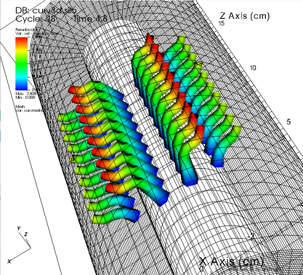
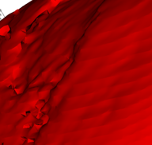
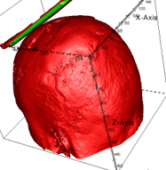
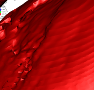
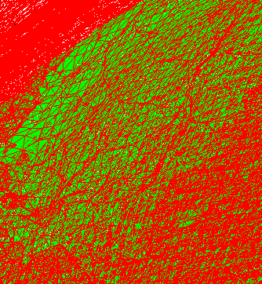
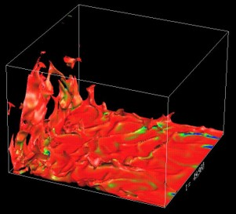
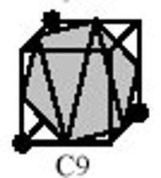
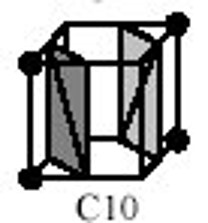
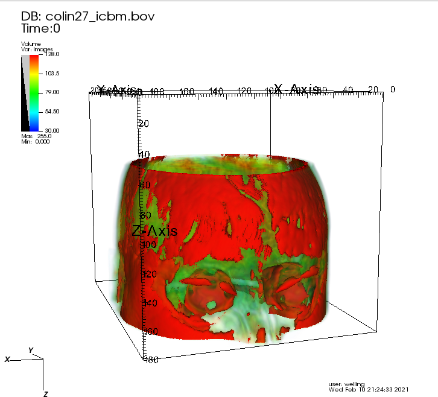
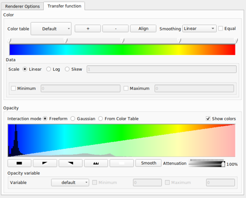

## A Bit About Scientific Visualization Algorithms

Once you choose an idiom, most visualization algorithms are simple:
* Figure out where to draw the mark
* Draw the mark
* repeat

For scientific vis the algorithms are a little more subtle, but they
are still simple.  We will look briefly at a few examples.

### Streamlines

These are the most common way of looking at vector fields.  VisIt generates them easily.

One sentence summary: calculate the trajectory of a particle as it is advected by the field,
then connect the dots.

More complete version:
* Pick a point in space $p$ at time $t_0$
* Estimate the vector field $V$ at that point
* Pick a small time step $dt$
* Starting from $p_0 = p(t_0)$, repeatedly do:
$$
p_{n+1} = p_n + V(x_{p_n}, t) dt
$$

This moves the point forward in steps.  Just keep repeating until:
* $p_{n+1}$ falls outside the region you are interested in
* $p_{n+1} == p_n$ , meaning it has stopped moving
* or you just lose interest.

Connect the dots with a curve, or a tube, or a ribbon.
Optionally add color and thickness to show more info.

### Constant Value Surfaces with Marching Cubes

 (The gloss requires knowing the normal direction at the surface).

These are drawn by creating a mesh of triangles.  If we zoom in and
tell VisIt to draw only the triangle edges, it looks like this: 

You can do a lot more than just MRI scans.  These images are from a fluid flow model by
Jim Ferry: 

The algorithm is very similar to the 'Marching Squares' algorithm for making contour plots.
The first (or almost first) description of 'Marching Cubes' is from William Lorensen and Harvey
Cline in 1987.

In 2D, we had 4 corners, and thus $2^4 = 16$ total cases.  That was made of a few shapes, each
of which had a few possible rotations.

In 3D, we have 8 corners, and thus $2^8 = 256$ total cases. There are many more shapes and
orientations.

For example, if 4 vertices are inside and 4 outside, here are a few of the possibilities: 

 And there are 3 more 4-and-4 cases beyond these.

Getting the lighting correct (making the surface 'shiny') requires knowing vectors normal to
(perpendicular to) the surface at the corner of every triangle.

One good way to get them is from the *gradient* of the data.  The gradient is just the vector
which points most 'uphill', so the negative of the gradient points away from the dense parts
of the data.

There are many, many variants on the 'Marching Cubes'.  You can do marching tetrahedra, for example.

### Volume Rendering

Volume rendering happens in steps.
1. Translate all the densities in the volume to RGBA tuples.
2. Calculate RGBA values for every pixel by integrating along the ray that
   passes through the pixel.
3. Divide out the opacity and draw the image.

Step 1: Translate all the density values in the volume into groups of 4 numbers
representing red, green, blue, and opacity (RGBA).  Think of these as having values
between 0.0 and 1.0 inclusive.  This just requires looking up the densities in a table. 

#### Step 2: The Right Way To Do It
For each pixel in the image:
* Calculate the origin and direction of the ray passing from the eye point through the pixel.
* If the ray passes through the volume, integrate the color and opacity of the ray over the region where it is within the volume.
* If it doesn't hit the volume, the color and opacity are just zero.

To do the integral:
* Start by setting R, G, B, and A for the ray to zero.
* Take small steps along the part of the ray that is actually inside the volume.  At each step, update the values for the ray according to the *compositing equation*.

The compositing equation says:
$$
A' = A + A_{sample}(1 - A)\\
$$
$$
R' = \frac{RA + R_{sample}A_{sample}(1-A)}{A'}
$$
and similarly for $G'$ and $B'$.

]

#### Step 2: What Everybody Actually Does

* Find the flat plane of voxels on the farthest away face of the volume.
* Warp it appropriately and draw it on the screen, as a single big rectangle.
* Repeat with the next-farthest plane of voxels, overlaying it on the previous
  image according to the compositing equation.  (Graphics hardware knows how).
* Repeat with the next-closest plane...
* and keep repeating.

This method is a form of *splatting*.  Think of building up the image from many
colored, semi-transparent snowballs, or by overlaying many semi-transparent
sheets of glass.

I've left out some warps and distortions of the images, but that's the gist
of it.  Graphics hardware can do this *very* fast.

#### An important application which doesn't involve volume data
[*NeRFs* (Neural Radience Fields)](https://www.matthewtancik.com/nerf)
are an amazing new application of
volume rendering, where the 'volume' is actually encoded in an
over-trained neural net.  If you are a gamer or interested in VR,
this is going to be a really big deal.